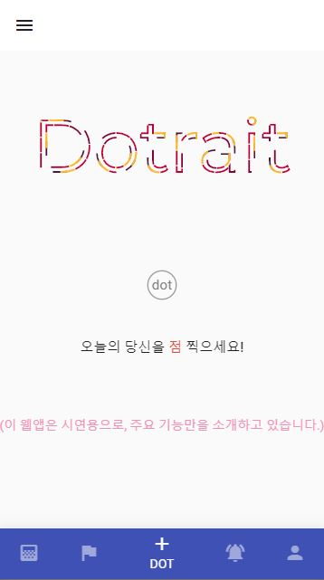
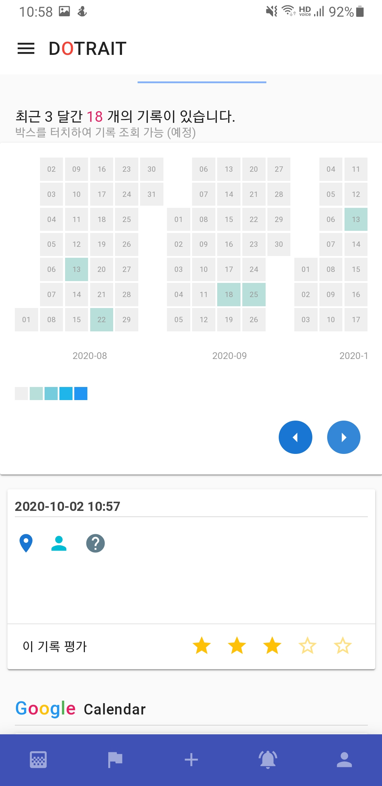

# dotrait
- 2018.07.26 ~ 2018.12.12
- 학생투표형 창업비즈니스 아이디어 출품작
- 1차, 2차가 있었으며, 이 레포는 1차 출품작 코드입니다. (2차 레포: https://github.com/kim-taewoo/dotrait-new)
- 프로토타입 주소: dottrait.firebaseapp.com/  (모바일 화면에 최적화되어 있습니다.)

## 캡쳐 이미지






## Build Setup

``` bash
# install dependencies
$ npm install

# serve with hot reload at localhost:3000
$ npm run dev

# build for production and launch server
$ npm run build
$ npm start
```

