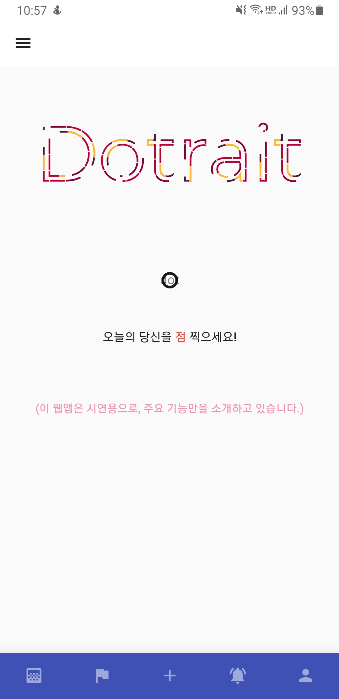
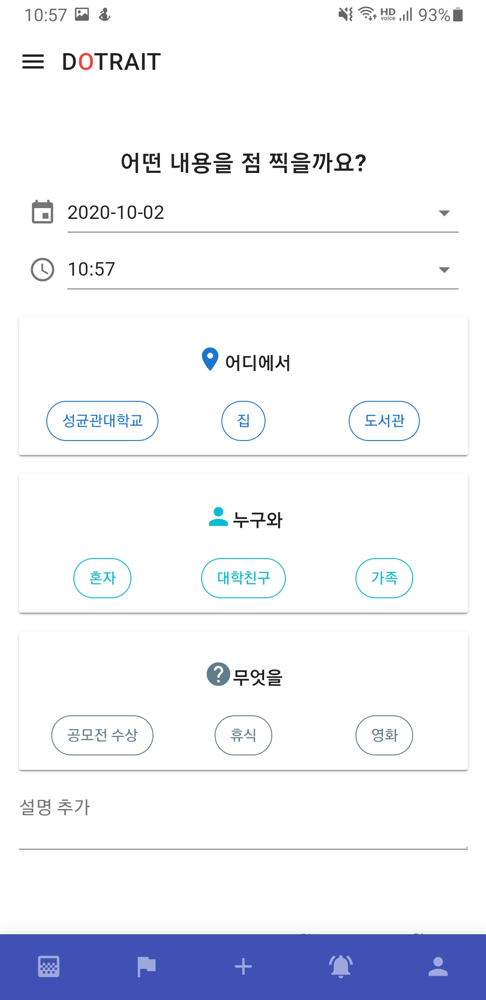
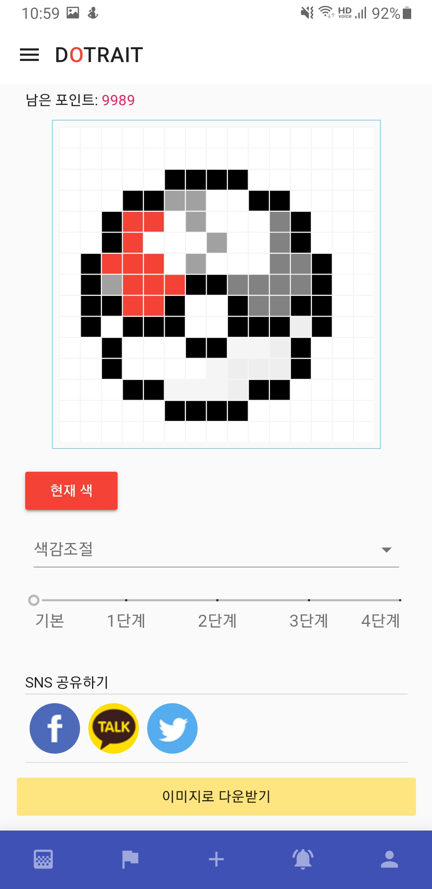
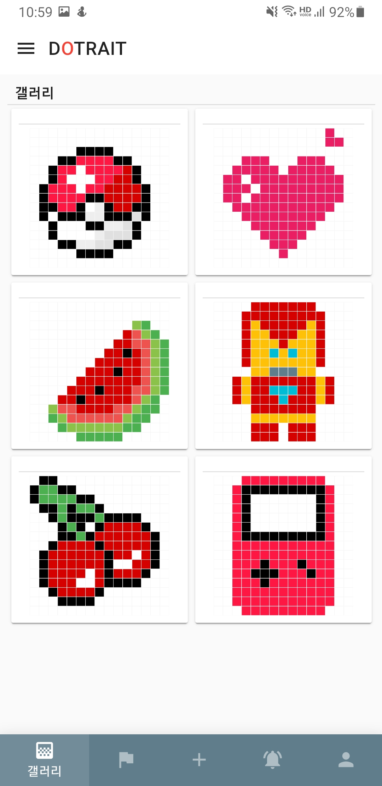
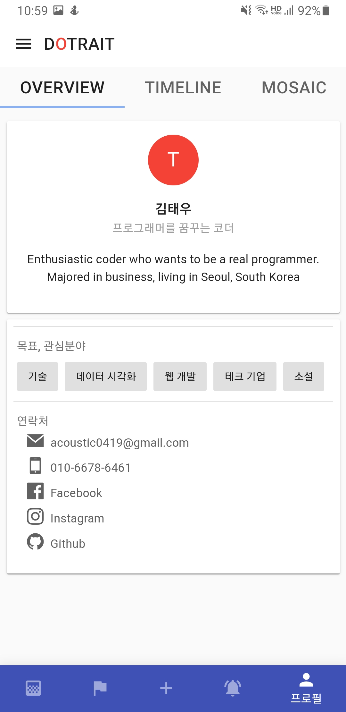

# dotrait
- 2018.07.26 ~ 2018.12.12
- 학생투표형 창업비즈니스 아이디어 출품작
- 프로토타입 주소: dottrait.firebaseapp.com/  (모바일 화면에 최적화되어 있습니다.)
- 1차, 2차가 있었으며, 이 레포는 1차 출품작 코드입니다. (2차 레포: https://github.com/kim-taewoo/dotrait-new)

## 사용 기술 스택
1. Vue
1. Nuxt
1. Google Calendar API(캘린더 연동)

## 캡쳐 이미지

|진입|기록남기기|기록흔적|
|---|---|---|
||||

|모자이크|갤러리|프로필|
|---|---|---|
||||

## Build Setup

``` bash
# install dependencies
$ npm install

# serve with hot reload at localhost:3000
$ npm run dev

# build for production and launch server
$ npm run build
$ npm start
```

